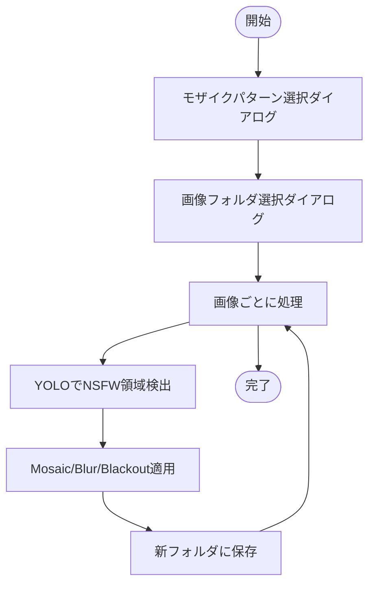

# NFSW自動モザイクツール

このツールは、YOLOベースのNSFW検出モデル（EraX-NSFW-V1.0）を用いて、画像内のセンシティブな領域を自動で検出し、モザイク・ぼかし・黒塗りなどの効果を一括で適用します。

## 必要なファイル・フォルダ

- mosaic-auto.py … メインの自動モザイクスクリプト
- nfsw-mosaic-auto.bat … Windows用バッチファイル（ダブルクリックで実行）
- erax_nsfw_yolo11m.pt … NSFW検出YOLOモデル（[EraX-NSFW-V1.0（HuggingFace）](https://huggingface.co/erax-ai/EraX-NSFW-V1.0) からダウンロード）
- yolov5/ … YOLOv5のコード一式（[Ultralytics YOLOv5公式](https://github.com/ultralytics/yolov5)）
- requirements.txt … 必要なPythonパッケージ
- README.md … この説明書

## 必要な環境

- Python 3.8 以上
- Windows（バッチファイル利用時）
- pipでrequirements.txtの内容をインストール

## インストール方法

1. 必要なファイル・フォルダを同じディレクトリに配置
2. コマンドプロンプトで以下を実行
   pip install -r requirements.txt
   ※ PyTorchのインストールでエラーが出る場合は[PyTorch公式サイト](https://pytorch.org/get-started/locally/)も参照してください。

## 使い方

### 1. バッチファイルから実行（推奨）

- nfsw-mosaic-auto.bat をダブルクリック
- モザイクパターン選択ダイアログが表示されるので、希望のパターンを選択
- 画像フォルダ選択ダイアログが表示されるので、処理したい画像フォルダを選択
- フォルダ内の画像が自動で処理され、元フォルダ名＋「_mc」の新フォルダに保存されます

### 2. コマンドラインから実行

python mosaic-auto.py <画像フォルダのパス>

- フォルダパスを省略すると、GUIでフォルダ選択ダイアログが表示されます

## 処理フロー

## 注意事項

- モデルファイル（erax_nsfw_yolo11m.pt）は同じフォルダに必要です
- yolov5/ フォルダも同じ階層に必要です
- make_love, nippleクラスは自動処理対象から除外されます
- モザイク範囲や強度はapply_pattern関数で調整可能です

## ライセンス

本ツールはオープンソースです。
- メインスクリプト・バッチファイル等はAGPL-3.0ライセンスに従います。
- yolov5/配下のコードは[Ultralytics YOLOv5公式](https://github.com/ultralytics/yolov5)のAGPL-3.0ライセンスです。詳細は[yolov5/LICENSE](yolov5/LICENSE)をご参照ください。
- erax_nsfw_yolo11m.pt（NSFW検出モデル）は[EraX-NSFW-V1.0（HuggingFace）](https://huggingface.co/erax-ai/EraX-NSFW-V1.0)の利用条件に従ってください。

## 参考リンク

- EraX-NSFW-V1.0モデル: https://huggingface.co/erax-ai/EraX-NSFW-V1.0
- YOLOv5公式: https://github.com/ultralytics/yolov5
- Ultralytics YOLOドキュメント: https://docs.ultralytics.com/
- PyTorch公式: https://pytorch.org/get-started/locally/
